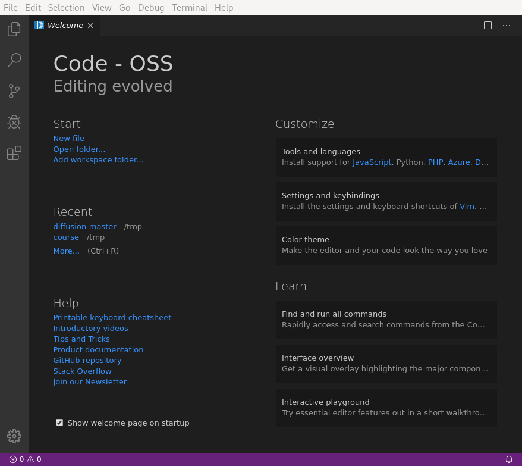

Completing this course requires you to have access to computer with some
software prerequisites installed. If you are attending a delivery of this course
in person through the Graduate School you have the option of using your own
laptop or an ICT managed PC at the workshop venue.

The below instructions can be used to setup the required software for your own
laptop. For ICT managed PC's setup steps will be covered during the
workshop. Please note that due to time constraints we are unable to support you
in setting up your laptop if you come to the workshop without the below
prerequisites installed and working. In this case you will need to use one of
the PC's provided.

## Conda

Conda is a Python distribution and package manager. We use both features to
provide the version of Python that is used in these materials and to setup
self-contained environments.

You can choose to install the full version of [anaconda][] or the more minimal
[miniconda][]. Either is suitable but make sure to choose the Python 3.*
version. If prompted, choose to install only for your user account and do not
install PyCharm.

[anaconda]: https://docs.anaconda.com/anaconda/install/
[miniconda]: https://docs.conda.io/projects/conda/en/latest/user-guide/install/

To test that the installation was successful follow the instructions for your
operating system below.

### Windows

* From the start menu search for and launch `Anaconda Prompt`.
* In the launched window type `conda env list` and press enter.
* You should see output similar to the below.

```bash
# conda environments:
#
base                  *  C:\Users\ccaveayl\AppData\Local\Continuum\anaconda3\
```

### Mac and Linux

* Launch a terminal
* In the launched window type `conda env list` and press enter.
* You should see output similar to the below.

```bash
# conda environments:
#
base                  *  /home/ccaveayl/anaconda3
```

## Visual Studio Code

This course will use Visual Studio (VS) Code as an integrated development
environment (IDE). You may already have a preferred IDE that you use regularly,
however we strongly suggest that you use VS Code for this course and afterwards
replicate the setup as you choose.

To install VS Code follow the instructions
[here](https://code.visualstudio.com).

You should then be able to launch VS code and see something like:



